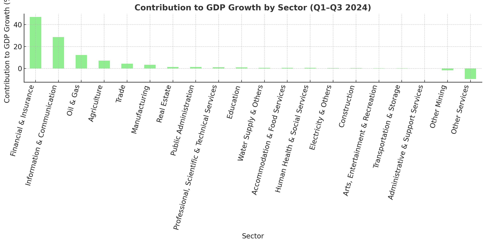

# NESG Sectoral Performance Analysis – Nigeria (Q1–Q3 2024)

## 📊 Overview
This report evaluates Nigeria’s sectoral performance for **Q1–Q3 2024**, based on:
- **Growth Rate (%)**
- **Contribution to GDP Growth (%)**
- **Share of GDP (%)**

Data covers **20 key sectors**, highlighting growth drivers and underperformers.

---

## 🚀 Key Highlights
- **Financial & Insurance** grew **30.3%**, contributing **47%** of GDP growth.  
- **Information & Communication** contributed **28.7%** with **12.9% GDP share**.  
- **Oil & Gas** grew **7%**, contributing **12.2%** to GDP growth.  
- **Agriculture (Crop Production)** remains structurally dominant (**20.3% share**) but contributed only **0.8%**.  

---

## 📉 Weak/Declining Sectors
- **Crude Petroleum & Natural Gas**: Negative GDP contribution (**-9.5%**).  
- **Arts, Entertainment & Recreation**: Minimal impact (0.3% contribution, 0.2% share).  
- Some **Manufacturing sub-sectors** underperformed.  

---

## 📈 Visualizations

### 1. Sectoral Growth Rates

### 2. Contribution to GDP Growth

### 3. Share of GDP by Sector

---

## 📌 Insights
1. **Finance and ICT are leading growth engines** beyond oil.  
2. **Agriculture is underperforming relative to its weight**, needing productivity reforms.  
3. **Oil & Gas remains structurally critical** but less dominant in growth.  
4. **Diversification** toward non-oil services is evident.  

---

## ✅ Recommendations
- **Strengthen ICT & Finance** as future growth anchors.  
- **Boost agricultural productivity** to align growth with GDP share.  
- **Stabilize oil sector** while reducing over-dependence.  
- **Support emerging sectors** (water, entertainment, etc.) for inclusiveness.  

---

## 📂 Dataset Summary
- **Sectors**: 20  
- **Period**: Q1–Q3 2024  
- **Indicators**: Growth Rate, Contribution to GDP Growth, Share of GDP  
